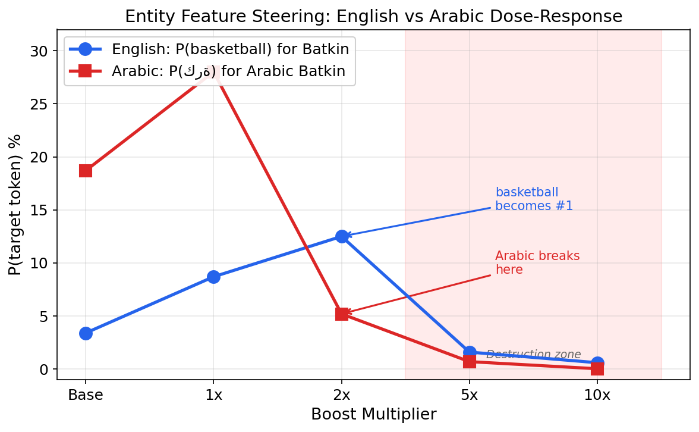
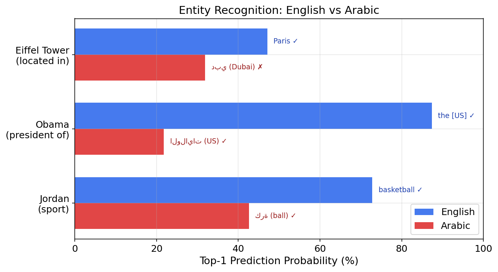
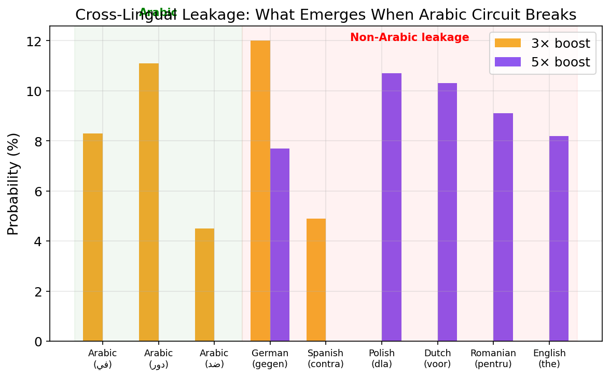
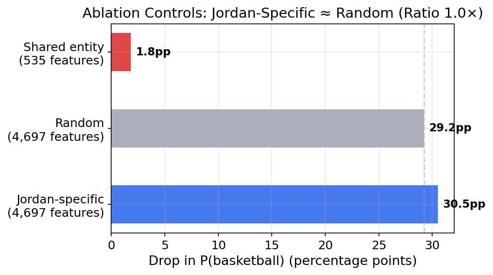
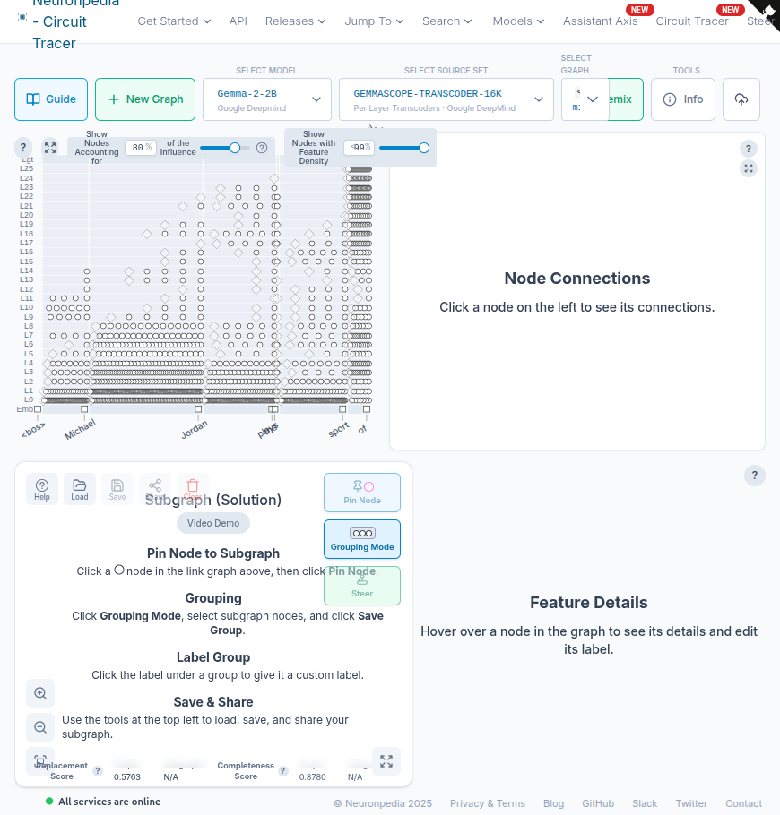
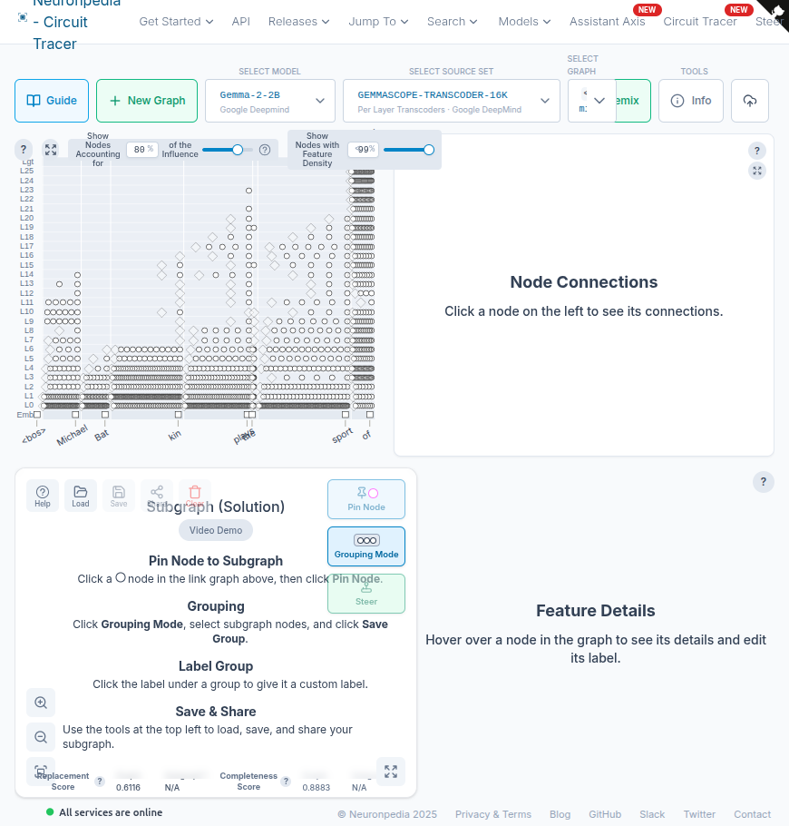
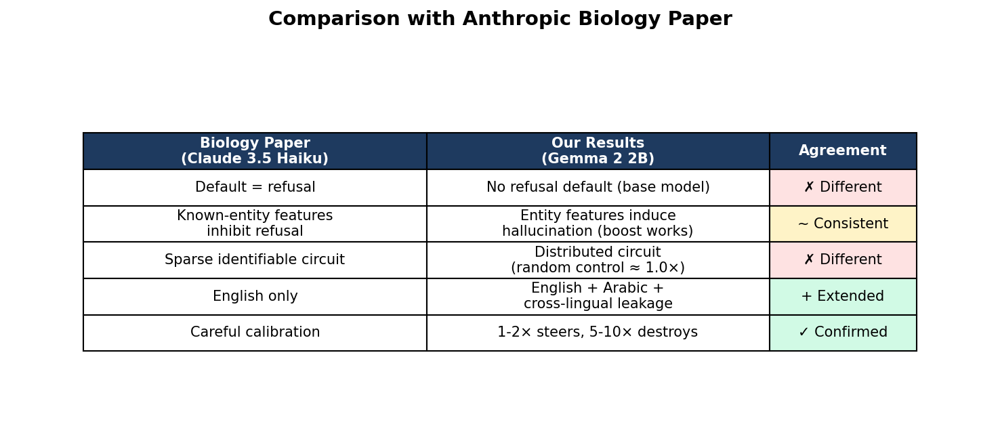

<h1 align="center">
  🧠 Hallucination Circuit Steering in Gemma 2 2B
</h1>

<p align="center">
  <b>Entity-recognition feature steering across English and Arabic — with cross-lingual leakage discovery</b>
</p>

<p align="center">
  <a href="https://www.alignmentforum.org/posts/YOUR_POST_ID"></a>
  <a href="https://colab.research.google.com/github/Hashem-Al-Qurashi/mech-interp-hallucination-circuit/blob/main/circuit_tracer_setup.ipynb"></a>
  <a href="https://www.neuronpedia.org/gemma-2-2b/graph?slug=michaeljordanpla-1773757470825"></a>
</p>

<p align="center">
  
  
  
  
  
  
</p>

---

## The Key Result

I took ~5,000 transcoder features that Gemma 2 2B uses to recognize "Michael Jordan" and injected them into a fictional person ("Michael Batkin") that the model has never seen. At **2× activation**, "basketball" became the **#1 prediction** for someone who doesn't exist.

Then I did the same thing in Arabic. **The circuit broke.**

<p align="center">
  
</p>

<p align="center"><i>English circuits tolerate 2× boost cleanly. Arabic circuits break at 2× — where English is still improving. The shaded region marks representation destruction.</i></p>

---

## 4 Causal Findings

### Finding 1: Entity Features Induce Hallucination

Boosting 4,697 Jordan-specific transcoder features onto an unknown entity at calibrated multipliers:

| Multiplier | P(basketball) for "Batkin" | Top-1 Prediction | vs Baseline (3.4%) |
|:---:|:---:|:---:|:---:|
| Baseline | 3.4% | golf | — |
| **1×** | **8.7%** | golf | **2.6× increase** |
| **2×** | **12.5%** | **basketball** | **3.7× increase** |
| 5× | 1.6% | course | destroyed |
| 10× | 0.6% | course | destroyed |

> At 2×, the model **hallucinates** that a fictional person plays basketball. The entity-recognition features are **sufficient** to induce hallucination at calibrated strength.

### Finding 2: Arabic Circuits Have a Narrower Operating Range

The same technique applied to Arabic reveals **entity-dependent fragility**:

<p align="center">
  
</p>

| Entity | English 2× | Arabic 2× | Arabic Breaking Point |
|:---|:---:|:---:|:---:|
| Michael Jordan | basketball (**works**) | ضد "against" (**broken**) | 2× |
| Barack Obama | — | الولايات "United States" (**correct**) | >2× |
| Eiffel Tower | — | دبي "Dubai" (**wrong but confident**) | robust |

The Arabic circuit works at 1× but breaks at 2× for Jordan — exactly where English is still improving. Obama's Arabic circuit actually steers to the **correct answer** (الولايات = United States). The Eiffel Tower predicts "Dubai" not Paris — **wrong knowledge, full confidence**.

> The steering mechanism operates on **confidence**, not **correctness**.

### Finding 3: Cross-Lingual Leakage

When Arabic circuits are pushed past their operating range (3×+), something unexpected happens — tokens from **5 other languages** emerge:

<p align="center">
  
</p>

| At 3× Arabic boost | At 5× Arabic boost |
|:---|:---|
| **gegen** (German: "against") | **dla** (Polish: "for") |
| دور (Arabic: "role") | **voor** (Dutch: "for") |
| في (Arabic: "in") | **pentru** (Romanian: "for") |
| **contra** (Spanish: "against") | the (English) |
| ضد (Arabic: "against") | **gegen** (German) |

All leaked tokens are **semantically coherent** — prepositions meaning "against" or "for" across German, Spanish, Polish, Dutch, and Romanian.

> Arabic transcoder features are **entangled** with other non-English representations. When pushed past their operating range, probability mass **leaks sideways** into other languages.

### Finding 4: Calibration is Non-Negotiable

| Language | Steering works | Begins breaking | Destroyed |
|:---|:---:|:---:|:---:|
| English | 1-2× | 5× | 10× |
| Arabic (Jordan) | 1× | 2× | 3×+ |
| Arabic (Eiffel Tower) | 1-2× | — | — |

> Any activation steering result at high multipliers is meaningless — it reflects representation destruction, not circuit behavior.

---

## 3 Honest Negatives

Negative results I ran, verified, and published anyway:

<p align="center">
  
</p>

| # | What I Tested | What Happened | What It Means |
|:---|:---|:---|:---|
| 1 | **Ablate 4,697 Jordan features** | Basketball drops 30pp... but ablating 4,697 **random** features drops it 29pp (ratio **1.0×**) | Large-scale ablation is general disruption, not circuit-specific |
| 2 | **Ablate 106 shared entity features** | 1.8% drop vs 7.0% for random 535 (ratio **0.26×**) | Shared features aren't the circuit — it's **distributed** |
| 3 | **Unknown entities activate more features** | Batkin: 7,035 features vs Jordan: 5,804 | Consistent with Biology paper but Level 2 only (no causal test) |

> The random ablation control killed my initial finding. I published it anyway — that's how science works.

---

## Interactive Attribution Graphs

Explore the full circuits on [Neuronpedia](https://www.neuronpedia.org/):

<table>
<tr>
<td align="center" width="50%">
<a href="https://www.neuronpedia.org/gemma-2-2b/graph?slug=michaeljordanpla-1773757470825">

</a>
<br><b>Michael Jordan (Known Entity)</b>
<br>1,305 nodes · 54,984 links
<br><a href="https://www.neuronpedia.org/gemma-2-2b/graph?slug=michaeljordanpla-1773757470825">🔗 Explore Interactive Graph →</a>
</td>
<td align="center" width="50%">
<a href="https://www.neuronpedia.org/gemma-2-2b/graph?slug=michaelbatkinpla-1773757866608">

</a>
<br><b>Michael Batkin (Fictional Entity)</b>
<br><a href="https://www.neuronpedia.org/gemma-2-2b/graph?slug=michaelbatkinpla-1773757866608">🔗 Explore Interactive Graph →</a>
</td>
</tr>
</table>

---

## Comparison with Prior Work

<p align="center">
  
</p>

| | Anthropic — Biology Paper (Claude 3.5 Haiku) | This Work (Gemma 2 2B base) | Status |
|:---|:---|:---|:---:|
| Default behavior | Refusal | No refusal (base model) | Different |
| Entity features | Inhibit refusal | **Induce hallucination** (boost works) | Consistent |
| Circuit structure | Sparse identifiable | **Distributed** (random control ≈ 1.0×) | Different |
| Languages | English only | **English + Arabic + 5-language leakage** | Extended |
| Calibration | Careful | **1-2× steers, 5-10× destroys** | Confirmed |

| | Ferrando et al. — ICLR 2025 (Gemma 2 2B) | This Work (same model) | Status |
|:---|:---|:---|:---:|
| Decomposition | SAEs | Transcoders (GemmaScope) | Different tool |
| Peak layer | Layer 9 | Layers 4-10 (peak at 6 and 10) | Broadly consistent |
| Languages | English only | **English + Arabic** | Extended |
| Cross-lingual | Not tested | **Leakage into 5 languages** | New |

---

## Why This Matters

**1.8 billion people speak Arabic.** GPT-4 responds to [79% of unsafe non-English prompts](https://arxiv.org/html/2310.06474v3). The behavioral gap is documented. The mechanistic explanation — *why* it happens at the circuit level — wasn't.

This work provides evidence that:
- Entity-recognition circuits have **narrower operating ranges** in Arabic than English
- Arabic features are **entangled** with other non-English representations
- The steering mechanism operates on **confidence, not correctness** — wrong knowledge gets steered with full confidence
- Safety evaluations calibrated on English will **overestimate robustness** for Arabic

---

## Reproduce Everything

### Requirements
- Google Colab Pro (A100 GPU recommended)
- HuggingFace account with Gemma 2 2B access

### Setup
```bash
# Install (numpy must be pinned AFTER circuit-tracer)
pip install git+https://github.com/safety-research/circuit-tracer.git
pip install "numpy==2.0.2"
# Then: Runtime → Restart session
```

### Run
Open [`circuit_tracer_setup.ipynb`](circuit_tracer_setup.ipynb) in Colab — 33 cells, 5 experimental phases, **all outputs saved** so you can verify without re-running.

| Phase | Cells | What It Does |
|:---|:---:|:---|
| 1. Setup | 1-4 | Install, GPU check, load Gemma 2 2B |
| 2. Baselines | 5-12 | English & Arabic completion-format prompts, feature counts |
| 3. Causal interventions | 13-20 | Zero-ablation, multi-multiplier boost, cross-lingual injection |
| 4. Controls | 21-28 | Random ablation control, shared features, scalpel ablation |
| 5. Arabic deep-dive | 29-33 | Arabic same-language boost, N=3 fragility test, leakage analysis |

### Runtime
~3-4 hours on A100 for all phases.

---

## Repository Structure

```
├── circuit_tracer_setup.ipynb    # Full experiment (33 cells, all outputs saved)
├── figures/
│   ├── fig1_dose_response.png    # English vs Arabic dose-response (THE key chart)
│   ├── fig2_en_vs_ar.png         # Entity recognition comparison
│   ├── fig3_leakage.png          # Cross-lingual leakage bars
│   ├── fig4_feature_counts.png   # Known vs unknown feature counts
│   ├── fig5_ablation.png         # Ablation controls (random kills finding)
│   ├── fig6_comparison.png       # Biology paper comparison table
│   ├── fig7_neuronpedia_jordan.png  # Jordan attribution graph
│   └── fig8_neuronpedia_batkin.png  # Batkin attribution graph
├── AF_POST_READY.md              # Full Alignment Forum write-up
├── RESULTS.md                    # All verified results with confidence levels
├── RESEARCH_CHECKLIST.md         # Quality gates used during research
└── README.md                     # You are here
```

---

## Built With

- **[circuit-tracer](https://github.com/safety-research/circuit-tracer)** — Anthropic's open-source attribution graph tool
- **[GemmaScope](https://huggingface.co/google/gemma-scope-2b-pt-transcoders)** — per-layer transcoders for Gemma 2 2B
- **[Neuronpedia](https://www.neuronpedia.org/)** — interactive circuit visualization
- **Google Colab Pro** — A100-SXM4-80GB

---

## What's Next

This is the **first of three studies** in a mechanistic interpretability sprint:

| # | Study | Status |
|:---|:---|:---:|
| 1 | Hallucination circuit steering (English + Arabic) | **Published** |
| 2 | Alignment faking detection via probes | In progress |
| 3 | Arabic safety evaluation at circuit level | Planned |

---

## Citation

If you use this work, please cite:

```bibtex
@misc{alqurashi2026hallucination,
  title={Entity-Recognition Feature Steering in Gemma 2 2B: Hallucination Induction, Arabic Circuit Asymmetry, and Cross-Lingual Leakage},
  author={Al-Qurashi, Hashem},
  year={2026},
  url={https://github.com/Hashem-Al-Qurashi/mech-interp-hallucination-circuit}
}
```

---

## Author

**Hashem Al-Qurashi** — AI Safety Researcher

Built from Egypt with Colab Pro ($10/month) and an A100.

*"Anyone could just go talk to a model. You can just do things."* — Neel Nanda

---

## License

MIT
